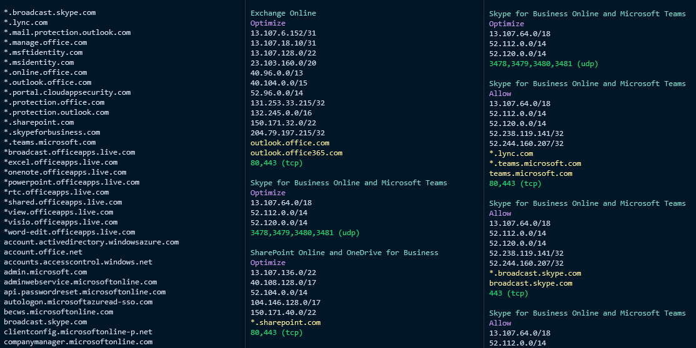

# Get-O365EndpointsPerCategory
 
This script connects to O365 endpoints RestAPI and keeping an offline version to run the script more efficient and to avoid making same requests to query for same data much often.

The "offline" version of the json file is stored in your AppData Temp folder - so the RestAPI will only be queried when this file is older than 1 day, otherwise the existing copy is used.

https://aka.ms/o365ips

**Specific switches**
```
[switch]$HttpOnly = filtering for 80/443 tcp endpoints only
```

**Examples**
```powershell
.\Get-O365EndpointsPerCategory.ps1 -Service Skype -Category Any -Required True -HttpOnly
.\Get-O365EndpointsPerCategory.ps1 -Service Any -Category OptimizeAllow -IPVersion IPv4 -Required True -URLsOnly -HttpOnly
.\Get-O365EndpointsPerCategory.ps1 -Service Skype -Category Optimize
.\Get-O365EndpointsPerCategory.ps1 -Service Skype -Category OptimizeAllow -IPsOnly
.\Get-O365EndpointsPerCategory.ps1 -Service Skype -Category OptimizeAllow -URLsOnly
.\Get-O365EndpointsPerCategory.ps1 -Service Exchange -Category Allow -IPversion IPv6 -Required True
.\Get-O365EndpointsPerCategory.ps1 -Service Any -Category Optimize
.\Get-O365EndpointsPerCategory.ps1 -Category Optimize -IPVersion IPv4
.\Get-O365EndpointsPerCategory.ps1 -Category OptimizeAllow -URLsOnly
.\Get-O365EndpointsPerCategory.ps1 -Service Any -Category Allow -Required True -IPVersion IPv6
.\Get-O365EndpointsPerCategory.ps1 -Service Common -Category Allow -Required True -IPversion IPv4
```

**The below picture shows the output for the following**
```powershell
.\Get-O365EndpointsPerCategory.ps1 -Category OptimizeAllow -URLsOnly
.\Get-O365EndpointsPerCategory.ps1 -IPVersion IPv4 -Category Optimize
.\Get-O365EndpointsPerCategory.ps1 -IPVersion IPv4 -Category OptimizeAllow Skype
```


